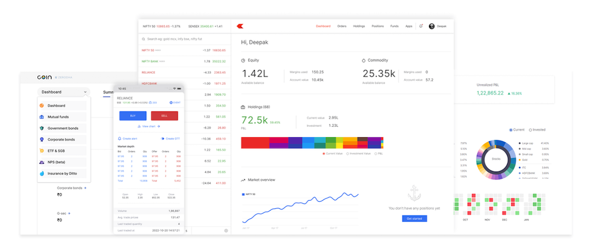

14. Zerodha Landing Page (Part 2)
  
In this project, I continued building a Zerodha-inspired landing page and explored key CSS styling techniques:

Color: Applying text and background colors.
  
Background: Customizing the background of elements.
  
Border & Border-Radius: Styling element borders and adding rounded corners.
  
Padding/Margin: Managing spacing inside and around elements.
  
Box Shadow: Adding depth to elements with subtle shadows.
  
Flexbox: Positioning and aligning elements effectively.
  
Most used properties:
justify-content: center: Centering elements within a container.
justify-content: space-between: Distributing elements evenly across the page.
  
Current Progress
We now have a simple, visually appealing landing page with the following layout:

Code-

         

            Signup
        

        

            About
        

        

            Product
        

        

            Pricing
        

        

            Support
        

 
 

 

         

    <h1 style="font-weight: 500; font-size: 40px;">Invest in everything</h1>

    <h2 style="font-weight: 400;">Online platform to invest in stocks, derivatives, mutual funds, ETFs, bonds, and more.</h2>

    

        Sign up for free
    

  

How It Looks
  
The page includes:

A navigation bar with links (Signup, About, Product, Pricing, Support).
  
A hero section featuring an image, title ("Invest in everything"), and a subtitle.
  
A call-to-action button: "Sign up for free."
  
Feel free to check out the code and suggest improvements! 🚀
